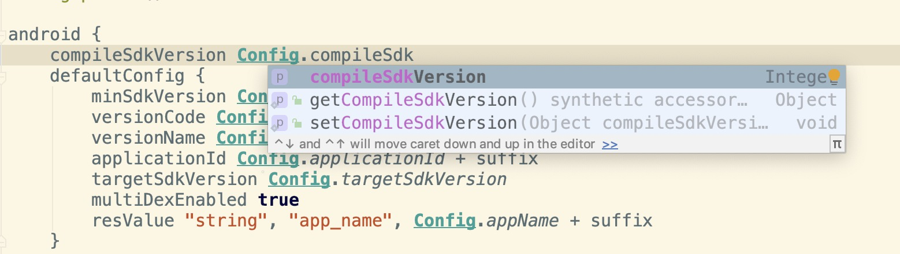
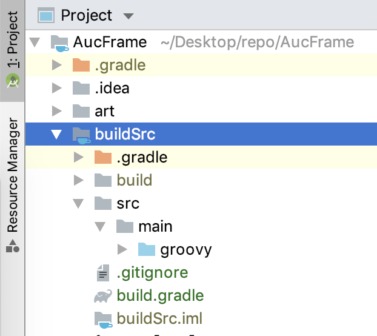

# AucFrame 之让你的 Gradle 更智能

## 环境
首先来明确下开发环境，这里推荐使用 Android Studio 3.5-Beta4 及以上的版本，或者 3.2.x 及以下的版本，具体原因会下面说明。

## 背景
如果你开发过稍微大型点的项目，项目中肯定会存有多个 module，那么多个 gradle 的管理便成了问题，曾经我也分享过 [Android 开发之版本统一规范](https://blankj.com/2016/09/21/android-keep-version-unity) 这样的 ext 管理方式，但在 gradle 中没有智能提示，也不能跳转到这些变量，局限性太高是个硬伤，那么现在有更好的解决方案吗？答案是肯定的，就是利用 `buildSrc` 来更好地管理 Gradle。


## 解决方案
首先声明下，该方式在 AS 的 3.3.x 版本以及 3.4.x 版本是有问题的，不能提供智能提示，所以如果想体验，要么使用 3.2.x 及以下的版本，要么使用 3.5-Beta4 及以上的版本，相关 bug 地址传送门：https://issuetracker.google.com/issues/123032843，我如今使用的版本是 3.5-Beta5 版本，一切如斯顺畅，效果图如下所示：



那么具体怎么操作呢，现在来揭晓其真面目，写过插件的肯定知道 `buildSrc` 这个目录，这个目录存在于项目根目录下，例如我这里就是 `AucFrameTemplate/buildSrc`，提醒一下，这个是要**自己创建**的哦，它默认是直接会参与编译，所以不用加入到 `setting.gradle` 中，具体如下图所示：



下面我们自己来建立它，首先是 `.gitignore`，这个文件没什么好说的，内容就是 `/build`。

其 `build.gradle` 文件如下所示：

```groovy
repositories {
    google()
    jcenter()
}

apply {
    plugin 'groovy'
    plugin 'java-gradle-plugin'
}

dependencies {
    implementation gradleApi()
    implementation localGroovy()
    implementation "commons-io:commons-io:2.6"
}
```

加完这两文件后 `sync` 下项目后便可以看到 `buildSrc` 目录下生成了 `buildSrc.iml`，这就代表 `buildSrc` 已经参与到项目编译中了。

接下来我们在 `buildSrc/src/main/groovy` 中创建 `Config.groovy` 文件，向其中写入如下内容（根据项目自己修改）：

```groovy
class Config {

    static applicationId = 'com.blankj.aucframe'            // TODO: MODIFY
    static appName = 'AucFrame'                             // TODO: MODIFY

    static compileSdkVersion = 27                           // TODO: MODIFY
    static minSdkVersion = 21                               // TODO: MODIFY
    static targetSdkVersion = 27                            // TODO: MODIFY
    static versionCode = 1_000_000                          // TODO: MODIFY
    static versionName = '1.0.0'// E.g. 1.9.72 => 1,009,072 // TODO: MODIFY
}
```

写完后我们再同步一下项目，现在你可以跳转到 app 中的 `build.gradle` 中，设置你所需要设置的属性即可，可设置成如下所示：

```groovy
android {
    compileSdkVersion Config.compileSdkVersion
    defaultConfig {
        minSdkVersion Config.minSdkVersion
        versionCode Config.versionCode
        versionName Config.versionName
        applicationId Config.applicationId
        targetSdkVersion Config.targetSdkVersion
    }
}
```

你会发现在输入过程中是支持智能提示的，也可以支持跳转，如上只是基本的操作，愣着干嘛啊，赶紧扣 6 吧，接下来我们做更刺激的操作。

## 打个小广告
欢迎加入我的知识星球「**[基你太美](https://t.zsxq.com/FmeqfYF)**」学习 [AucFrame](https://blankj.com/2019/07/22/auc-frame/) 框架，目前只有 50 个名额，价格是 ¥66 一年，到期日为 2020/07/15，平均一天 2 毛都不用，但你却可以快速学习到该牛逼的组件化框架，50 个之后我会先运行一段时间看是否可行再决定升价来更好地运行它，所以，各位 Androder 还在等什么，当然，进来之后试看发现内容并不喜欢，我也可以无条件全额给你退款，但我相信这份教程绝对值这个价钱，学完后你也会比其他人更加优秀。在学习过程中遇到的问题或者有其他 Android 相关的疑问，我有空都可以帮你解答，而且，星球中分享的不仅于 [AucFrame](https://blankj.com/2019/07/22/auc-frame/) 框架，关于大厂的面试经验、内推通道、[AndroidUtilCode](https://github.com/Blankj/AndroidUtilCode) 的使用我也可以提供帮助，目的就是为了把更多优秀的人聚在一起来分享更多的资源让大家一同提升。