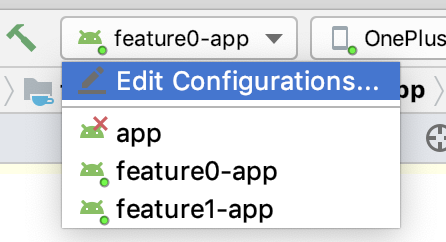

# AucFrame 之统一管理 Gradle

[「AucFrame 之统一管理 Gradle」源码传送门](https://github.com/Blankj/AucFrameTemplate/releases/tag/2)

## 管理 lib 的 Gradle
首先，我们再看一遍 AucFrame 的架构图。


我们从下开始往上搭建，在根目录创建 `lib` 文件夹，在项目中新建一个 `Android Library` 类型的 `base` module，然后删除其中的 `base.iml`，因为不删除 `base.iml` 文件的话会影响后续的移动，把 `androidTest` 以及 `test` 测试目录删了也没事，然后我们把 `base` 文件夹移入到 `lib` 中，最后我们修改 `setting.gradle` 文件中的 `':base'` 为 `:lib:base`，最后点击 Gradle 的同步即可，最终会在 `lib` 下生成 `lib.iml`，`base` 下生成 `lib-base.iml` 表示成功，结果如下所示：


同样的方式，我们创建 `:lib:common`，接下来配置他们的依赖关系。

我们可以看到 `base` 和 `common` 的 `build.gralde` 简直一毛一样，这样我们是否可以把他们都抽出去呢，答案是肯定的。

我们在项目根目录创建 `buildLib.gradle` 文件，代表所有 `lib` 类型的模块都可以使用它，我们放入公共内容即可，具体如下所示：

```groovy
apply {
    plugin "com.android.library"
    plugin "kotlin-android"
    plugin "kotlin-android-extensions"
}

android {
    compileSdkVersion Config.compileSdkVersion

    defaultConfig {
        minSdkVersion Config.minSdkVersion
        versionCode Config.versionCode
        versionName Config.versionName
    }

    buildTypes {
        release {
            minifyEnabled false
            proguardFiles getDefaultProguardFile('proguard-android-optimize.txt'), 'proguard-rules.pro'
        }
    }

    lintOptions {
        abortOnError false
    }
}
```

可以看到，我们使用到了 `Config.groovy` 中的属性，这样方便所有 lib 的版本都一致，说到版本一致，那么我们还要统一第三方库的依赖，很简单，我们在 `Config.groovy` 中创建依赖库的配置，如今它长这样：

```groovy
class Config {

    static applicationId = 'com.blankj.aucframe'            // TODO: MODIFY
    static appName = 'AucFrame'                             // TODO: MODIFY

    static compileSdkVersion = 27                           // TODO: MODIFY
    static minSdkVersion = 21                               // TODO: MODIFY
    static targetSdkVersion = 27                            // TODO: MODIFY
    static versionCode = 1_000_000                          // TODO: MODIFY
    static versionName = '1.0.0'// E.g. 1.9.72 => 1,009,072 // TODO: MODIFY

    static kotlin_version = '1.3.10'
    static support_version = '27.1.1'
    static leakcanary_version = '1.6.3'

    static depConfig = [
            plugin       : [
                    gradle: "com.android.tools.build:gradle:3.3.0",
                    kotlin: "org.jetbrains.kotlin:kotlin-gradle-plugin:$kotlin_version",
            ],
            support      : [
                    appcompat_v7: "com.android.support:appcompat-v7:$support_version",
                    design      : "com.android.support:design:$support_version",
                    multidex    : "com.android.support:multidex:1.0.2",
                    constraint  : "com.android.support.constraint:constraint-layout:1.1.3",
            ],
            kotlin       : "org.jetbrains.kotlin:kotlin-stdlib-jdk7:$kotlin_version",
            utilcode     : "com.blankj:utilcode:1.25.0",
            free_proguard: "com.blankj:free-proguard:1.0.1",
            swipe_panel  : "com.blankj:swipe-panel:1.1",

            leakcanary   : [
                    android         : "com.squareup.leakcanary:leakcanary-android:$leakcanary_version",
                    android_no_op   : "com.squareup.leakcanary:leakcanary-android-no-op:$leakcanary_version",
                    support_fragment: "com.squareup.leakcanary:leakcanary-support-fragment:$leakcanary_version",
            ],
    ]
}
```

接下来就是让 `base` 和 `common` 应用它们了，我们往 `base` 的 `build.gradle` 写入如下完整内容：

```groovy
apply {
    from "${project.rootDir.path}/buildLib.gradle"
}

dependencies {
    implementation fileTree(include: ['*.jar'], dir: 'libs')
    api Config.depConfig.utilcode
    api Config.depConfig.free_proguard
    api Config.depConfig.swipe_panel

    api Config.depConfig.support.appcompat_v7
    api Config.depConfig.support.design
    api Config.depConfig.support.multidex
    api Config.depConfig.support.constraint
    api Config.depConfig.kotlin
    compileOnly Config.depConfig.leakcanary.android_no_op.dep
}
```

由于我们 `common` 模块是依赖 `base` 的，所以 `common` 的配置如下所示：

```groovy
apply {
    from "${project.rootDir.path}/buildLib.gradle"
}

dependencies {
    api project(":lib:base")
}
```

写入的内容都比较简单，我就不一一解释了，下面我们来管理 feature。

现在我们往 `base` 模块放两个基础类 ———— `BaseApplication` 和 `BaseActivity`，在 `common` 中放入两个公共类 ———— `CommonApplication` 和 `CommonBackActivity` 以及一些公共资源，具体请查阅源码，接下来让我们来管理 frature。


## 管理 feature 的 Gradle

### 管理 export 的 Gradle

再看一遍架构图，我们可以发现 feature 中每个 feature 中都存有 app、pkg（、export） 模块，我们自底向上来一步步操作，现在我们在根目录创建 feature 目录，在 feature 目录下创建 feature0 及 feature1 目录，和创建 `base` 类似，我们在 feature0 和 feature1 中创建 `export` 模块，注意两个 feature 中的 `export` 包名要区分开，我这里分别是 `com.blankj.feature0.export`、`com.blankj.feature1.export`，建立完之后的 `setting.gradle` 文件如下所示：

```groovy
include ':app', ':lib:base', ':lib:common',
        ':feature:feature0:export', ':feature:feature1:export',
```

由于 `export` 是依赖 `common` 的，所以两个 `export` 的 `build.gradle` 如下所示：

```groovy
apply {
    from "${project.rootDir.path}/buildLib.gradle"
}

dependencies {
    api project(":lib:common")
}
```

现在我们 `gradle` 同步一下，可以发现两个 `export` 已经被添加进来了。

### 管理 pkg 的 Gradle

我们以相同的方式创建两个 `pkg`，包名分别是 `com.blankj.feature0.pkg`、`com.blankj.feature1.pkg`，建立完后的 `setting.gradle` 文件如下所示：

```groovy
include ':app', ':lib:base', ':lib:common',
        ':feature:feature0:export', ':feature:feature1:export',
        ':feature:feature0:pkg', ':feature:feature1:pkg'
```

`pkg` 我们暂时只依赖各自的 `export`，后面我们会再改成全量依赖 `export`，所以 `:feature:feature0:pkg` 的 `build.gradle` 如下所示：

```groovy
apply {
    from "${project.rootDir.path}/buildLib.gradle"
}

dependencies {
    api project(":feature:feature0:export")
}
```

`:feature:feature1:pkg` 的 `build.gradle` 同理。

`gradle` 同步一下，可以发现两个 `pkg` 已经被添加进来了，现在我们在 `:feature:feature0:pkg` 中添加一个 `Feature0Activity`，以及在 `:feature:feature1:pkg` 中添加一个 `Feature1Activity`，具体请参看源码。

### 管理 app 的 Gradle

`pkg` 上层就是 `mock` 层了，因为这层是可选的，我们暂时先跳过，后面我们用到的时候再来搞定它，那么现在就只剩下各个 `app` 了，首先，我们利用类似和 `buildLib.gradle` 相似的方式，在根目录创建公共的 `buildApp.gradle` 文件，内容如下所示。

```groovy
apply {
    plugin "com.android.application"
    plugin "kotlin-android"
    plugin "kotlin-android-extensions"
}

android {
    defaultConfig {
        minSdkVersion Config.minSdkVersion
        versionCode Config.versionCode
        versionName Config.versionName
        applicationId Config.applicationId + suffix
        targetSdkVersion Config.targetSdkVersion
        multiDexEnabled true
        resValue "string", "app_name", Config.appName + suffix
    }

    buildTypes {
        debug {
            minifyEnabled false
            proguardFiles getDefaultProguardFile('proguard-android.txt'), 'proguard-rules.pro'
        }
        release {
            minifyEnabled true
            proguardFiles getDefaultProguardFile('proguard-android.txt'), 'proguard-rules.pro'
        }
    }

    packagingOptions {
        exclude 'META-INF/*'
    }

    dexOptions {
        preDexLibraries true
        javaMaxHeapSize "8g"
        maxProcessCount 8
        dexInProcess = true
    }
}

dependencies {
    // LeakCanary
    debugImplementation Config.depConfig.leakcanary.android
    debugImplementation Config.depConfig.leakcanary.support_fragment
    releaseImplementation Config.depConfig.leakcanary.android_no_op
}

def getSuffix() {
    if (project.path == ":feature:launcher:app") return ""
    return project.path.replace(":", "_").substring(":feature".length(), project.path.length() - ":app".length())
}
```

这样我们在每个 app 中的 `build.gradle` 都可以使用这些公共属性，细心的朋友应该可以看到我这边除了 `launcher` 以外，每个 `applicationId` 都是都是带有 feature 的模块名后缀的，具体方法就是 getSuffix()，方便我们在手机上同时装多个应用。

我们先删除根目录下的 app 目录，在 feature0 和 feature1 中以相同的方式创建两个 `app`，包名分别是 `com.blankj.feature0.app`、`com.blankj.feature1.app`，建立完后的 `setting.gradle` 文件如下所示：

```groovy
include ':lib:base', ':lib:common',
        ':feature:feature0:export', ':feature:feature1:export',
        ':feature:feature0:pkg', ':feature:feature1:pkg',
        ':feature:feature0:app', ':feature:feature1:app'
```

`app` 是只依赖各自的 `pkg`，所以 `:feature:feature0:app` 的 `build.gradle` 如下所示：

```groovy
apply {
    from "${project.rootDir.path}/buildApp.gradle"
}

dependencies {
    api project(":feature:feature0:pkg")
}
```

`:feature:feature1:app` 的 `build.gradle` 同理。

同步一下项目可以发现两个 `app` 也被编译到了项目中，在可运行 app 列表中已经有了 `feature0-app` 和 `feature1-app`，如下图所示：



现在我们在 `:feature:feature0:app` 中添加一个 `Feature0App`，以及在 `:feature:feature1:app` 中添加一个 `Feature1App`，具体请参看源码，然后把设置各自的 `AndroidManifest.xml`，我这里以 `:feature:feature0:app` 中的为例：

```xml
<?xml version="1.0" encoding="utf-8"?>
<manifest xmlns:android="http://schemas.android.com/apk/res/android"
    package="com.blankj.feature0.app">

    <application
        android:name="com.blankj.feature0.app.Feature0App"
        android:allowBackup="false"
        android:icon="@mipmap/ic_launcher"
        android:label="@string/app_name"
        android:theme="@style/AppTheme">
        <activity android:name="com.blankj.feature0.pkg.Feature0Activity">
            <intent-filter>
                <action android:name="android.intent.action.VIEW" />
                <action android:name="android.intent.action.MAIN" />

                <category android:name="android.intent.category.LAUNCHER" />
            </intent-filter>
        </activity>
    </application>

</manifest>
```

可以发现，我们加入了 `Feature0Activity` 作为启动页，这样便可快速调试它，同理，`:feature:feature1:app` 的 `AndroidManifest.xml` 也是如此，此时我们便可单独运行一下它们了，由于他们的 `applicationId` 是不同的，所以两者可以同时安装。

下面，我们和之前上述一样的方式来创建最顶层的 `:feature:launcher:app` 模块，目前我们让它依赖 `:feature:feature0:pkg` 和 `:feature:feature1:pkg` 模块，后续我们会让它支持动态化配置，其 `build.gradle` 如下所示：

```groovy
apply {
    from "${project.rootDir.path}/buildApp.gradle"
}

dependencies {
    api project(":feature:feature0:pkg")
    api project(":feature:feature1:pkg")
}
```

把其加入到 `setting.gradle` 中，同步一下 gradle，会发现可运行 app 中多了个 `launcher-app`，我们创建一个 `LauncherApp`，这里我们假设 app 的入口就在 feature0 中，故配置 `:feature:launcher:app` 中的 `AndroidManifest.xml` 如下所示：

```xml
<?xml version="1.0" encoding="utf-8"?>
<manifest xmlns:android="http://schemas.android.com/apk/res/android"
    package="com.blankj.feature0.app">

    <application
        android:name="com.blankj.feature0.app.Feature0App"
        android:allowBackup="false"
        android:icon="@mipmap/ic_launcher"
        android:label="@string/app_name"
        android:theme="@style/AppTheme">
        <activity android:name="com.blankj.feature0.pkg.Feature0Activity">
            <intent-filter>
                <action android:name="android.intent.action.VIEW" />
                <action android:name="android.intent.action.MAIN" />

                <category android:name="android.intent.category.LAUNCHER" />
            </intent-filter>
        </activity>
    </application>

</manifest>
```

我们把三个应用都装到手机上，应用名分别为 `AucFrame`、`AucFrame_feature0`、`AucFrame_featrue1`，到此，我们统一管理 Gradle 已结束。
